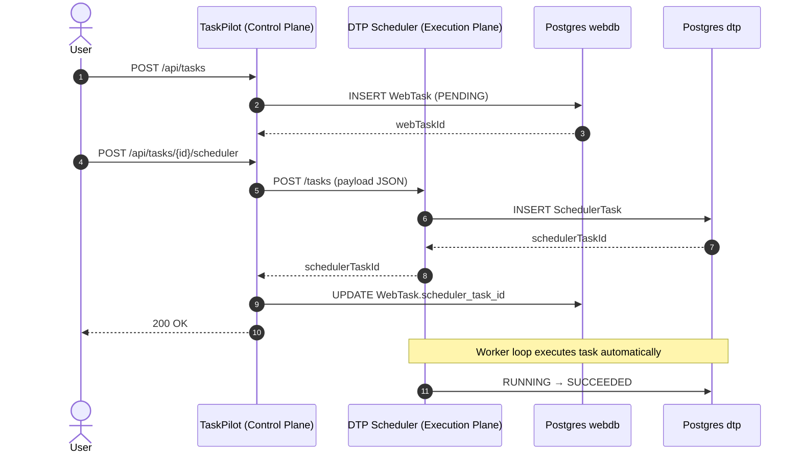
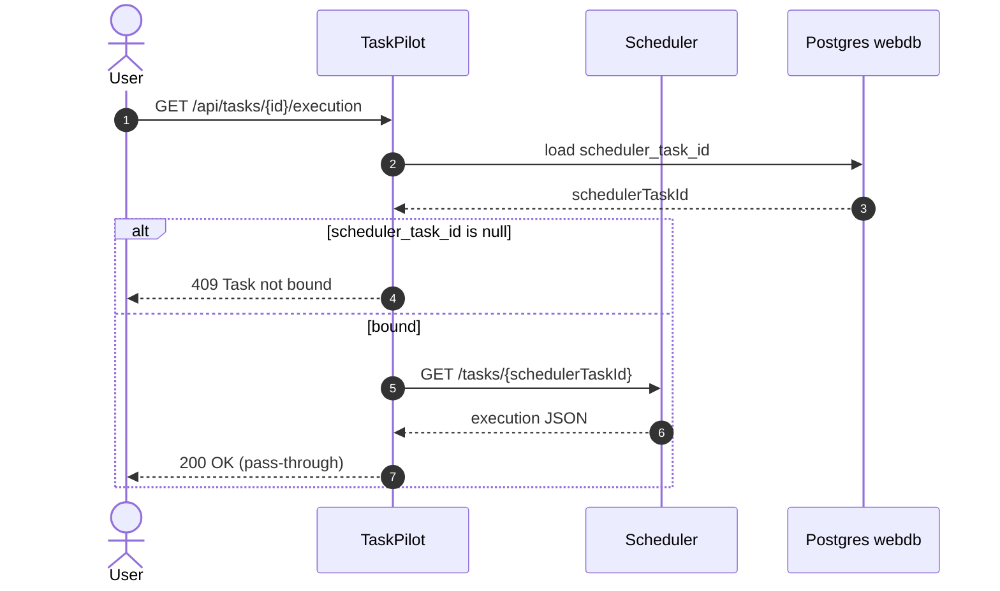
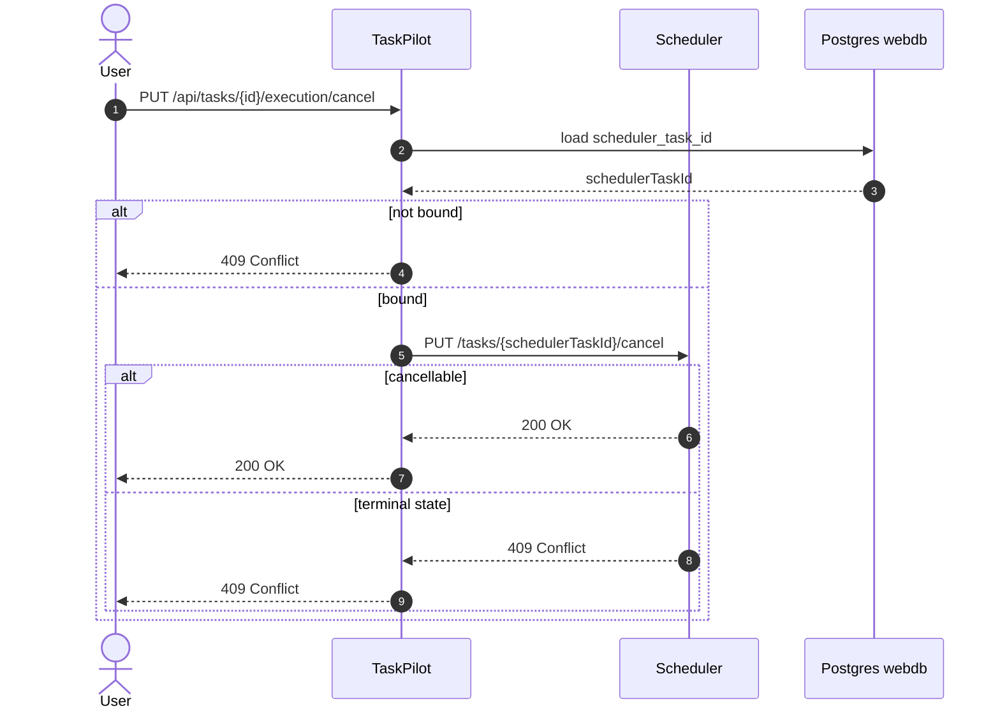

## High-Level Architecture (Control Plane vs Execution Plane)

                        ┌──────────────────────────┐
                        │          User            │
                        │  (curl / UI / API call)  │
                        └─────────────┬────────────┘
                                      │
                                      ▼
                    ┌────────────────────────────────┐
                    │          TaskPilot              │
                    │        (Control Plane)          │
                    │                                  │
                    │  - Create WebTask                │
                    │  - Bind SchedulerTask            │
                    │  - Expose execution endpoints    │
                    │                                  │
                    │  /api/tasks                      │
                    │  /api/tasks/{id}/scheduler       │
                    │  /api/tasks/{id}/execution       │
                    │  /api/tasks/{id}/execution/cancel│
                    └─────────────┬──────────────────┘
                                  │
                   HTTP (REST API)│
                                  ▼
          ┌────────────────────────────────────────────┐
          │      Distributed Task Platform (DTP)       │
          │           (Execution Plane)                │
          │                                            │
          │  - Task queue                              │
          │  - Worker loop                             │
          │  - Retry logic                             │
          │  - State transitions                       │
          │                                            │
          │  /tasks                                    │
          │  /tasks/{id}                               │
          │  /tasks/{id}/cancel                        │
          └─────────────┬──────────────────────────────┘
                        │
                        ▼
                 ┌──────────────────┐
                 │   PostgreSQL     │
                 │                  │
                 │  webdb  (control)│
                 │  dtp    (execute)│
                 └──────────────────┘
## Execution Lifecycle (Create → Bind → Auto-Execute)

## Execution Query

## Cancel flow

### ✅ Separation of concerns

-   Control plane = intent

-   Execution plane = runtime

### ✅ Ownership boundaries

-   TaskPilot owns orchestration

-   Scheduler owns execution semantics

### ✅ Correct error propagation

-   Scheduler decides what is cancellable

-   TaskPilot does not override runtime truth

### ✅ Real-world parallels

This architecture directly maps to:

| Your Project | Real System |
| --- | --- |
| TaskPilot | Kubernetes API Server |
| DTP | kubelet / controller |
| WebTask | Pod spec |
| SchedulerTask | Pod runtime |
| /execution | kubectl get pod |

TaskPilot acts as a control plane that manages task intent and orchestration, while execution is fully delegated to a distributed scheduler. Execution endpoints exist to observe and control runtime behavior without coupling the control plane to execution semantics.
