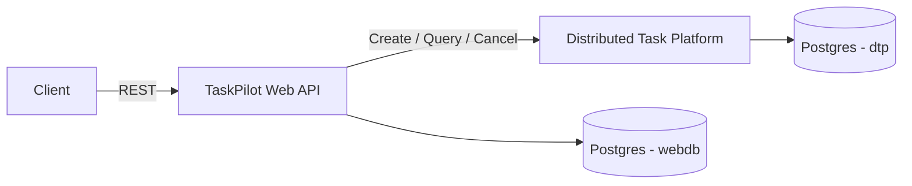
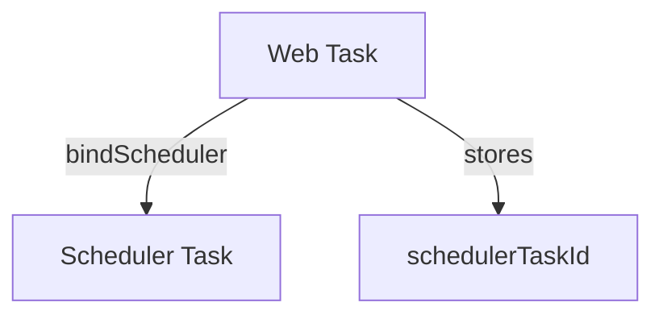
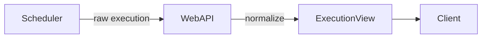

📘 TaskPilot --- Architecture & Usage
===================================

TaskPilot is a **web orchestration layer** built on top of a distributed task scheduler.\
It provides user-facing APIs, lifecycle tracking, and execution observability while delegating actual execution to the scheduler.

* * * * *

🧱 Architecture Overview
------------------------

### High-Level Flow

**Responsibilities**

| Component | Responsibility |
| --- | --- |
| Web API | User-facing task lifecycle & orchestration |
| Scheduler | Distributed execution, retry, backoff, workers |
| Web DB | Stores web task metadata + schedulerTaskId |
| Scheduler DB | Execution state, retries, timing |

* * * * *

### Task Binding Relationship

TaskPilot never executes work directly.\
It creates and links scheduler-side tasks and tracks execution via `schedulerTaskId`.

* * * * *

### Execution Read Model

TaskPilot transforms scheduler-specific execution data into a stable, user-friendly execution view.

* * * * *

🚀 Quickstart
-------------

### Prerequisites

-   Docker

-   Java 21

-   Maven

### Start all services
```bash
docker compose up -d
```
Services:

| Service | Port |
| --- | --- |
| TaskPilot Web API | `8081` |
| Distributed Task Platform | `8080` |
| Postgres | `5432` |

🔧 API Lifecycle Examples

Base URL:
```bash
http://localhost:8081
```
1️⃣ Create Task

Creates a web-level task.
```bash
curl -X POST http://localhost:8081/api/tasks

  -H "Content-Type: application/json"

  -d '{

    "type": "demo",

    "payload": "hello"

  }'
```
Response (example)
```bash
{

  "id": 14,

  "status": "PENDING",

  "schedulerTaskId": null

}
```
2️⃣ Bind Scheduler

Creates a scheduler-side task and links it.
```bash
curl -X POST http://localhost:8081/api/tasks/14/scheduler

  -H "Content-Type: application/json"

  -d '{

    "schedulerType": "demo-slow"

  }'
```
Behavior:

-   Scheduler task is created

-   `schedulerTaskId` is persisted

-   Operation is **idempotent**

3️⃣ Get Execution Status

Retrieves normalized execution data from the scheduler.
```bash
curl http://localhost:8081/api/tasks/14/execution
```
Response (example)
```bash
{

  "schedulerTaskId": 9,

  "status": "SUCCEEDED",

  "attemptCount": 1,

  "maxAttempts": 3,

  "retryState": "COMPLETED",

  "scheduledFor": "2026-01-29T20:51:42.077Z",

  "processingStartedAt": "2026-01-29T20:51:42.109Z",

  "completedAt": "2026-01-29T20:51:42.941Z",

  "queueLatencyMs": 32,

  "processingLatencyMs": 64,

  "endToEndLatencyMs": 96

}
```
Derived latency metrics are computed dynamically by TaskPilot.

4️⃣ Cancel Execution

Cancels a scheduled or running task in the scheduler.
```bash
curl -X PUT http://localhost:8081/api/tasks/14/execution/cancel
```
Response
```bash
204 No Content
```
This endpoint is idempotent --- repeated cancel requests safely return 204 once the task is canceled.

✅ Execution Semantics

| Scenario | Result |
| --- | --- |
| Task not bound | `409 Conflict` |
| Already canceled | `204 No Content` |
| Already succeeded | `409 Conflict` |
| Scheduler missing task | `404 Not Found` |

TaskPilot translates downstream scheduler responses into consistent HTTP semantics.
